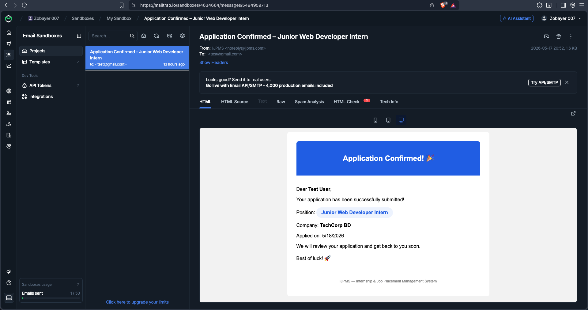
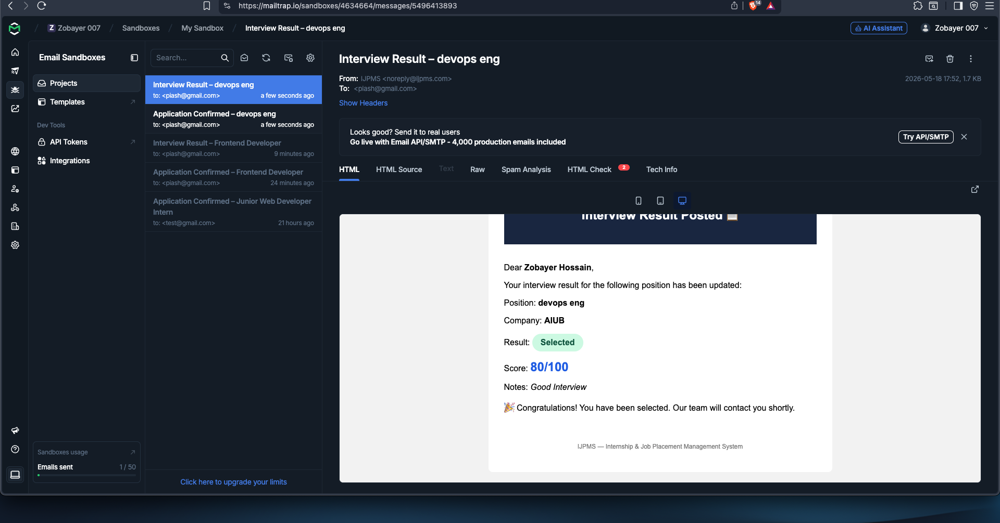

# IJPMS — Internship & Job Placement Management System API

A secure, RESTful backend API built with NestJS to manage internship and job placement operations.

---

## 📌 Project Abstraction

The **Internship & Job Placement Management System (IJPMS)** digitises the end-to-end lifecycle of internship applications — from posting positions and receiving applications to assigning interview results and generating candidate performance reports.

**Three user roles:**
- **Applicant** — Browse positions, apply, track applications
- **Recruiter** — Post positions, review applicants, assign results
- **Admin** — Full access to manage everything

---

## 🛠️ Tech Stack

| Category | Technology |
|---|---|
| Language | TypeScript |
| Framework | NestJS 11 |
| Database | PostgreSQL 16 |
| ORM | TypeORM |
| Authentication | JWT + Passport |
| Password Security | bcryptjs |
| Email | @nestjs-modules/mailer + Nodemailer |
| Email Testing | Mailtrap |
| Templates | Handlebars |
| Validation | class-validator + class-transformer |
| Documentation | Swagger UI (@nestjs/swagger) |
| Version Control | Git + GitHub |

---

## 🗄️ Database Schema

```
User
─────────────────────────
id          UUID (PK)
fullName    VARCHAR
email       VARCHAR (unique)
password    VARCHAR (hashed)
role        ENUM (applicant/recruiter/admin)
department  VARCHAR
createdAt   TIMESTAMP
updatedAt   TIMESTAMP
```

```
Position
─────────────────────────
id          UUID (PK)
title       VARCHAR
company     VARCHAR
description TEXT
deadline    DATE
slots       INTEGER
recruiterId UUID (FK → User)
createdAt   TIMESTAMP
updatedAt   TIMESTAMP
```

```
Application
─────────────────────────
id             UUID (PK)
applicantId    UUID (FK → User)
positionId     UUID (FK → Position)
status         ENUM (pending/selected/rejected/waitlisted)
triageLevel    ENUM (high/medium/low)
interviewScore INTEGER
notes          TEXT
appliedAt      TIMESTAMP
updatedAt      TIMESTAMP
```

### Relationships
- **One-to-Many** — One Recruiter → Many Positions
- **Many-to-One** — Many Positions ← One Recruiter
- **Many-to-Many** — Many Applicants ↔ Many Positions (via Application entity)

---

## 🔌 API Endpoints

### Auth
| Method | Endpoint | Description | Auth |
|---|---|---|---|
| POST | /auth/register | Register new user | Public |
| POST | /auth/login | Login, returns JWT | Public |
| GET | /auth/me | Get current user | JWT |

### Positions
| Method | Endpoint | Description | Auth |
|---|---|---|---|
| POST | /positions | Create position | Recruiter/Admin |
| GET | /positions | List all positions | JWT |
| GET | /positions/:id | Get single position | JWT |
| PATCH | /positions/:id | Update position | Recruiter/Admin |
| DELETE | /positions/:id | Delete position | Recruiter/Admin |

### Applications
| Method | Endpoint | Description | Auth |
|---|---|---|---|
| POST | /applications | Apply for position | Applicant |
| GET | /applications/mine | My applications | Applicant |
| GET | /applications/triage | Triage system | Recruiter/Admin |
| GET | /applications/report/:id | Performance report | Recruiter/Admin |
| PATCH | /applications/:id/result | Assign result | Recruiter/Admin |
| DELETE | /applications/:id | Withdraw application | Applicant/Admin |

### Users
| Method | Endpoint | Description | Auth |
|---|---|---|---|
| GET | /users | List all users | Admin |
| DELETE | /users/:id | Delete user | Admin |

---

## 📧 Email Notifications

Emails are sent automatically on key actions:

| Trigger | Recipient | Subject |
|---|---|---|
| Applicant applies | Applicant | Application Confirmed – [Position] |
| Recruiter assigns result | Applicant | Interview Result – [Position] |

**Testing:** Mailtrap sandbox (development)

---

## ⚙️ Setup & Run

### Prerequisites
- Node.js v18+
- PostgreSQL 16
- npm

### Installation

```bash
# Clone the repo
git clone https://github.com/ZobayerHossain/ijpms-backend.git
cd ijpms-backend

# Install dependencies
npm install

# Setup environment
cp .env.example .env
# Fill in your .env values

# Run in development
npm run start:dev
```

### Environment Variables (.env.example)

```env
# Database
DB_HOST=localhost
DB_PORT=5432
DB_USERNAME=your_username
DB_PASSWORD=your_password
DB_NAME=ijpms_db

# JWT
JWT_SECRET=your_secret_key
JWT_EXPIRES_IN=7d

# Mail (Mailtrap)
MAIL_HOST=sandbox.smtp.mailtrap.io
MAIL_PORT=2525
MAIL_USER=your_mailtrap_user
MAIL_PASS=your_mailtrap_pass
MAIL_FROM=noreply@ijpms.com

# App
PORT=3000
```

---

## 📖 API Documentation

Swagger UI available at:
[http://localhost:3000/api/docs](http://localhost:3000/api/docs)

## 📬 Email Evidence

### Application Confirmation Email



## 🏗️ Project Structure

```
src/
├── auth/               → JWT auth, guards, strategies
├── users/              → User entity, management
├── positions/          → Internship positions CRUD
├── applications/       → Applications, triage, reports
├── mail/               → Email service + templates
├── common/
│   ├── filters/        → Global exception filter
│   └── interceptors/   → Response interceptor
├── main.ts             → App bootstrap + Swagger
└── app.module.ts       → Root module
```

## 👨‍💻 Author

**(Zobayer Hossain Piash)**
American International University – Bangladesh (AIUB)
CSC 4161 – Advanced Programming in Web Technologies